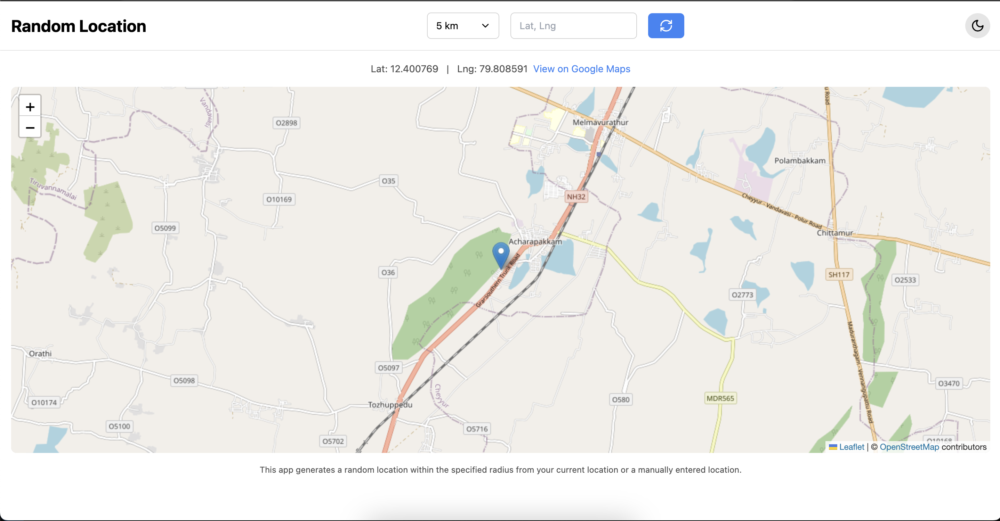

# Random Location Application

## Introduction

The Random Location application displays a random location on a map within a specified radius from the user's current location or a manually entered location. This tool provides an interactive way to visualize different geographical areas.




## Tech Stack Used

- **React:** For building the user interface.
- **TypeScript:** For type safety and better development experience.
- **Tailwind CSS:** For styling and responsive design.
- **Leaflet:** For rendering the interactive map.
- **Lucide React:** For integrating various icons.
- **gh-pages:** For deploying the application to GitHub Pages.

## Functionality and Usage

- **Radius Selection:** Choose a radius from a dropdown list or enter a custom radius.
- **Location Entry:** Manually enter a location or use the browser’s geolocation.
- **Random Location:** Display a random location within the specified radius on the map.

Visit the application at [https://pappater.github.io/randomlocation/](https://pappater.github.io/randomlocation/) to see it in action.

## Responsiveness

The application is designed to be fully responsive, adjusting to various screen sizes and orientations to ensure a seamless experience across different devices.

## Building the App

### Key Packages

- **`gh-pages` (v6.1.1):** Used for deploying the application to GitHub Pages. This package helps publish your project directly from the `gh-pages` branch.
- **`leaflet` (v1.9.4):** A leading open-source JavaScript library for interactive maps. It provides an easy-to-use API to create and manage maps.
- **`lucide-react` (v0.441.0):** Provides a collection of icons for React, allowing easy integration of various icons in the application’s UI.

### Deployment with `gh-pages`

1. **Install `gh-pages`:**

   ```bash
   npm install gh-pages --save-dev
   ```

2. **Add deployment scripts to `package.json`:**

   ```json
   "scripts": {
     "predeploy": "npm run build",
     "deploy": "gh-pages -d build"
   }
   ```

3. **Deploy the application:**

   ```bash
   npm run deploy
   ```

4. **Verify the deployment** by visiting the provided GitHub Pages URL.

## Installation Instructions

1. **Clone the repository:**

   ```bash
   git clone https://github.com/pappater/randomlocation.git
   ```

2. **Navigate to the project directory:**

   ```bash
   cd randomlocation
   ```

3. **Install dependencies:**

   ```bash
   npm install
   ```

4. **Run the application locally:**
   ```bash
   npm start
   ```

## Usage Instructions

- Open the application in your browser.
- Select or enter a radius.
- Choose a location option (manual or geolocation).
- View the random location on the map.

## Configuration

- **Environment Variables:** If applicable, document any required environment variables or configuration files.

## Troubleshooting

- **Common Issues:**

  - **Issue:** Application does not load.

    - **Solution:** Ensure all dependencies are installed and the `npm start` command is executed in the project directory.

  - **Issue:** Map does not display.
    - **Solution:** Check the Leaflet integration and ensure API keys or tokens are correctly configured.

## Contribution Guidelines

- **Code Style:** Follow the project’s coding standards and use ESLint for linting.
- **Submitting Changes:** Use pull requests to submit changes. Ensure to provide a description of the changes and any related issues.

## Changelog

- **[Version 1.0.0]** Initial release with basic features.
- **[Version 1.1.0]** Added custom radius input and improved map responsiveness.

## Node Version

The application is developed using Node.js version v20.15.0.
